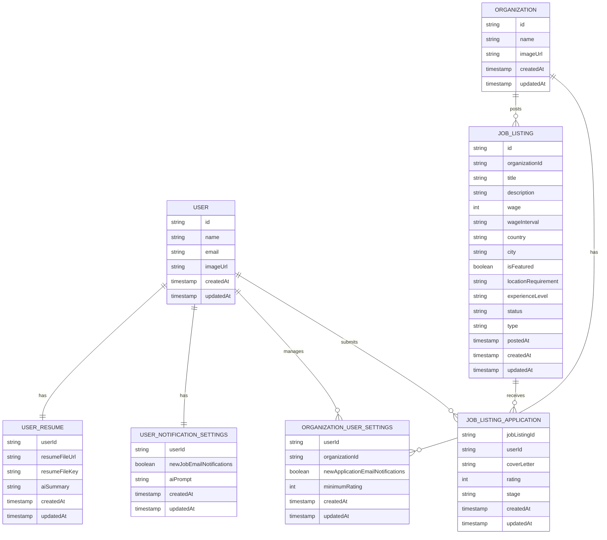

# Entity-Relationship Diagram (ER)

## ✅ Validation Notes

- **User**: Individual job seekers
- **Organization**: Employer companies (from Clerk)
- **JobListing**: Job postings by organizations
- **JobListingApplication**: Applications from users to job listings (composite PK: jobListingId + userId)
- **UserResume**: User's uploaded resume with AI summary
- **UserNotificationSettings**: Email preferences + AI prompt for job search
- **OrganizationUserSettings**: Organization-specific preferences (email notifications, minimum rating filter)

## Key Enums

| Field | Values |
|-------|--------|
| `JobListing.wageInterval` | `hourly`, `yearly` |
| `JobListing.locationRequirement` | `in-office`, `hybrid`, `remote` |
| `JobListing.experienceLevel` | `junior`, `mid-level`, `senior` |
| `JobListing.status` | `draft`, `published`, `delisted` |
| `JobListing.type` | `internship`, `part-time`, `full-time` |
| `JobListingApplication.stage` | `denied`, `applied`, `interested`, `interviewed`, `hired` |
