# Use Case Diagram

```mermaid
graph TB
    subgraph CareerBridge["CareerBridge System"]
        subgraph JobSeekerFeatures["Job Seeker Features"]
            UC1["Search Jobs with AI"]
            UC2["Upload Resume"]
            UC3["Apply to Job"]
            UC4["View Application Status"]
            UC5["Manage Notifications"]
            UC6["View Resume Summary"]
        end
        
        subgraph EmployerFeatures["Employer Features"]
            UC7["Post Job Listing"]
            UC8["Manage Job Listings"]
            UC9["View Applications"]
            UC10["View AI Candidate Ranking"]
            UC11["Update Application Stage"]
            UC12["Configure Notification Settings"]
        end
        
        subgraph SystemFeatures["System Features"]
            UC13["Clerk Authentication"]
            UC14["Resume AI Summarization"]
            UC15["Application Auto-Ranking"]
            UC16["Email Notifications"]
            UC17["File Upload"]
        end
    end
    
    JobSeeker["👤 Job Seeker"]
    Employer["👤 Employer"]
    System["🔧 System"]
    
    JobSeeker -->|uses| UC1
    JobSeeker -->|uses| UC2
    JobSeeker -->|uses| UC3
    JobSeeker -->|uses| UC4
    JobSeeker -->|uses| UC5
    JobSeeker -->|uses| UC6
    
    Employer -->|uses| UC7
    Employer -->|uses| UC8
    Employer -->|uses| UC9
    Employer -->|uses| UC10
    Employer -->|uses| UC11
    Employer -->|uses| UC12
    
    UC2 -->|triggers| UC14
    UC3 -->|triggers| UC15
    UC5 -->|triggers| UC16
    UC12 -->|triggers| UC16
    UC2 -->|uses| UC17
```



## Use Case Descriptions

### Job Seeker Use Cases

| Use Case | Actor | Description | Trigger |
|----------|-------|-------------|---------|
| **Search Jobs with AI** | Job Seeker | Search for jobs using natural language (AI-powered semantic search) | User enters search query in AI search page |
| **Upload Resume** | Job Seeker | Upload PDF resume; system extracts text and generates AI summary | User selects file in resume upload page |
| **Apply to Job** | Job Seeker | Submit application with optional cover letter | User clicks "Apply" on job listing |
| **View Application Status** | Job Seeker | Track status of submitted applications (applied → interested → interviewed → hired/denied) | User navigates to applications dashboard |
| **Manage Notifications** | Job Seeker | Toggle email notifications for new jobs; set AI search prompt | User edits notification settings |
| **View Resume Summary** | Job Seeker | View AI-extracted summary of uploaded resume | User navigates to resume page |

### Employer Use Cases

| Use Case | Actor | Description | Trigger |
|----------|-------|-------------|---------|
| **Post Job Listing** | Employer | Create and publish new job posting | Employer clicks "New Job" in dashboard |
| **Manage Job Listings** | Employer | Edit, delist, or feature existing job postings | Employer views job listings list |
| **View Applications** | Employer | See all applications for a job; filter by status | Employer clicks on a job listing |
| **View AI Candidate Ranking** | Employer | See applications ranked by relevance (powered by AI) | Employer views application list for a job |
| **Update Application Stage** | Employer | Move application through pipeline (applied → interested → interviewed → hired/denied) | Employer changes stage in application card |
| **Configure Notification Settings** | Employer | Set minimum rating threshold; toggle email notifications for new applications | Employer edits org settings |

### System Use Cases

| Use Case | Description | Trigger | Tool |
|----------|-------------|---------|------|
| **Clerk Authentication** | Sign-in, org selection, user/org sync | User signs in or org management changes | Clerk SDK + Webhooks |
| **Resume AI Summarization** | Extract resume text and generate AI summary | Resume upload completes | Inngest + Claude API |
| **Application Auto-Ranking** | Rank applications by relevance to job | New application submitted | Inngest + Claude/Gemini API |
| **Email Notifications** | Send daily job digest or application updates | Scheduled (daily) or event-triggered | Resend + React Email |
| **File Upload** | Handle resume file storage and retrieval | Resume upload | UploadThing |

## Actor Interactions

```
Job Seeker                          CareerBridge System                    Employer
    |                                      |                                  |
    |-- Search Jobs ----------------->    |                                  |
    |                               (AI semantic search)                       |
    |                                      |                                  |
    |-- Upload Resume ------------->      |                                  |
    |                            (Extract + Summarize)                        |
    |                                      |                                  |
    |-- Apply to Job ------------>        |-- Rank Applications -->           |
    |                                      |                             (View Rankings)
    |<-- Notification Update --------      |<-- Update Stage -------          |
    |                          (Email)     |                                  |
```
