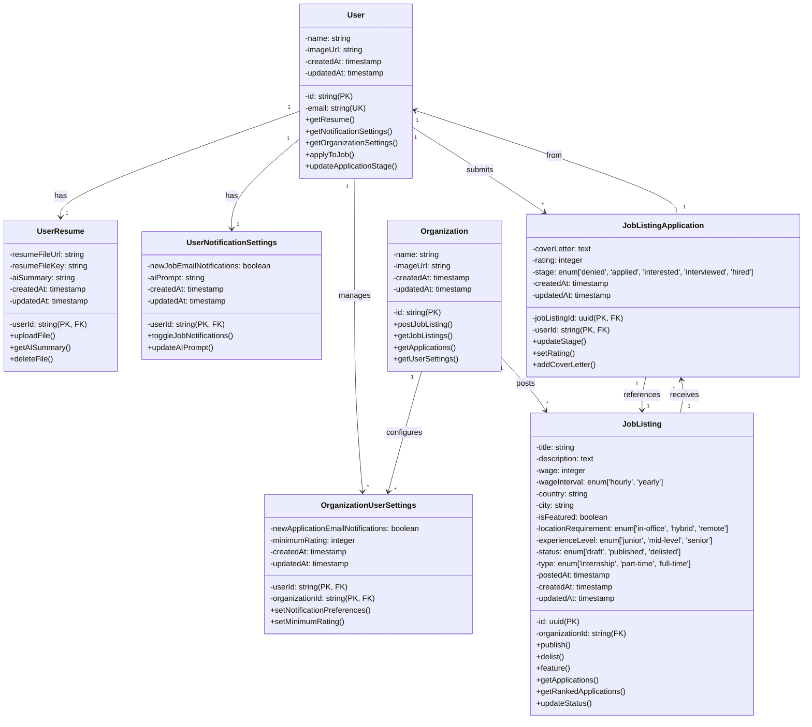

# Class Diagram

## Class Relationships Summary

| From | To | Type | Cardinality | Description |
|------|-----|------|-------------|-------------|
| **User** | UserResume | Composition | 1:1 | Each user has one resume |
| **User** | UserNotificationSettings | Composition | 1:1 | Each user has notification settings |
| **User** | OrganizationUserSettings | Aggregation | 1:* | User can belong to multiple organizations |
| **User** | JobListingApplication | Composition | 1:* | User can submit multiple applications |
| **Organization** | JobListing | Composition | 1:* | Organization posts multiple jobs |
| **Organization** | OrganizationUserSettings | Composition | 1:* | Organization has multiple user settings |
| **JobListing** | JobListingApplication | Composition | 1:* | Job receives multiple applications |

## Key Methods by Domain

### User Domain
- `applyToJob()` - Submit application
- `updateApplicationStage()` - Employer updates candidate status
- `getResume()` - Retrieve user's resume data
- `getNotificationSettings()` - Get user notification preferences

### JobListing Domain
- `publish()` - Make job visible to job seekers
- `delist()` - Remove job from search
- `feature()` - Highlight job (premium feature)
- `getRankedApplications()` - Get AI-ranked candidates
- `updateStatus()` - Change job listing state

### Organization Domain
- `postJobListing()` - Create new job posting
- `getJobListings()` - Fetch all org's jobs
- `getApplications()` - Fetch all applications across jobs
- `getUserSettings()` - Org-specific user preferences
