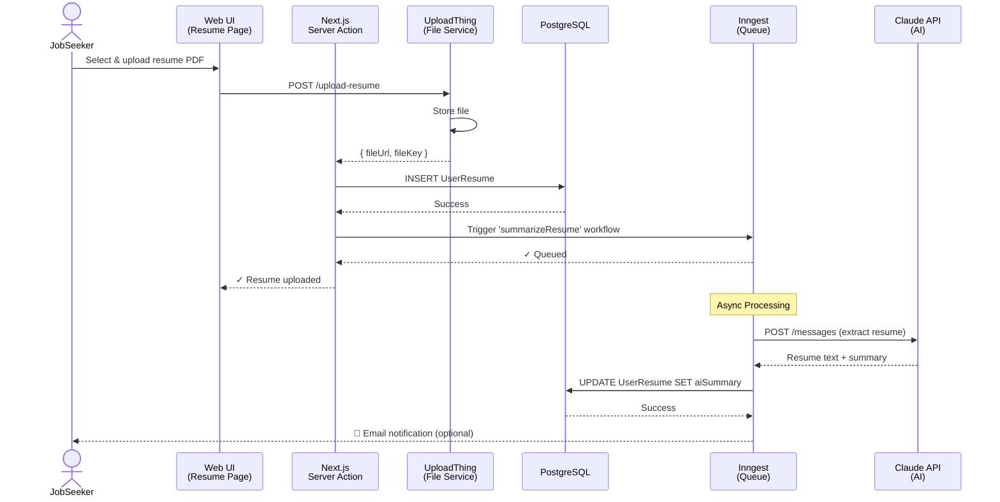
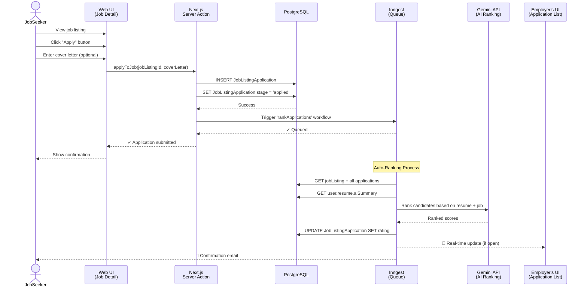
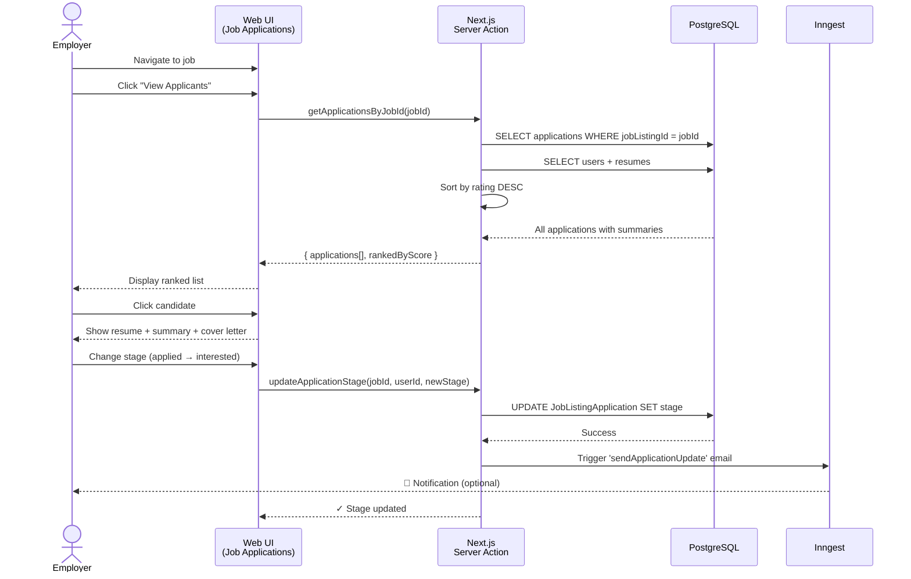
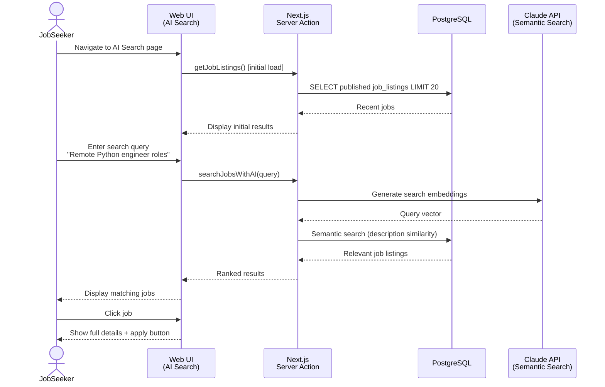
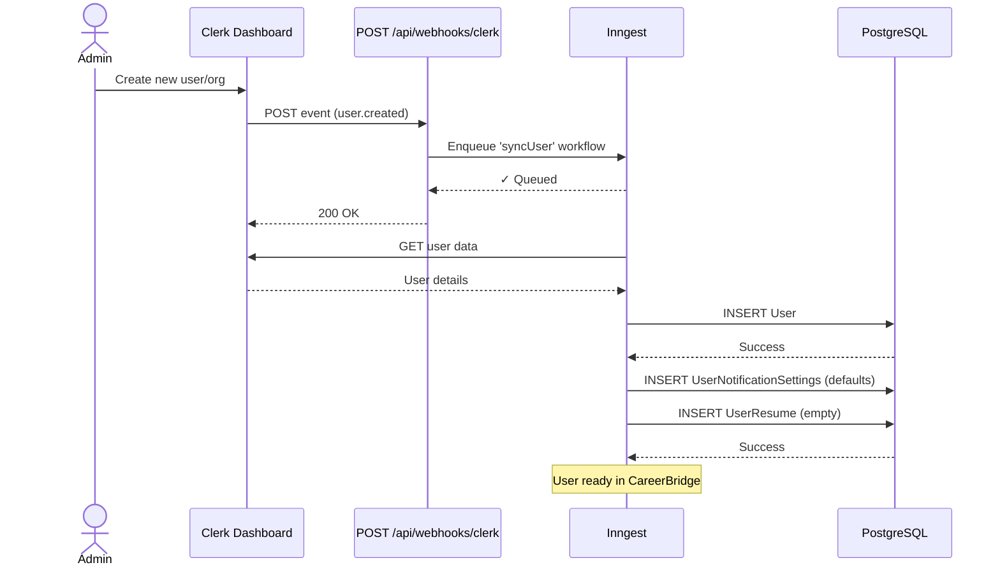
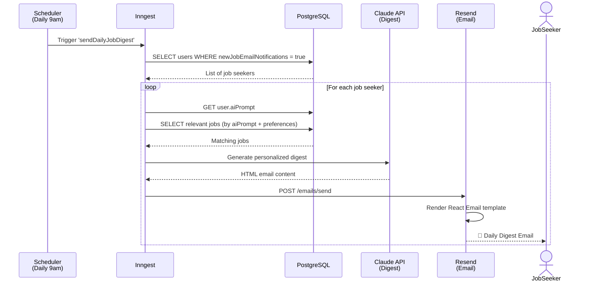

# Sequence Diagrams

## Flow 1: User Uploads Resume (with AI Summarization)

## Flow 2: Job Seeker Applies to Job

## Flow 3: Employer Views Ranked Candidates

## Flow 4: Job Seeker Searches Jobs with AI

## Flow 5: Clerk Webhook - New User Sync

## Flow 6: Daily Job Digest Email

## Key Integration Points

| Flow | External Services | Cache Strategy | Error Handling |
|------|-------------------|-----------------|----------------|
| Resume Upload | UploadThing, Claude | UserResume cached | Retry on API failure |
| Job Application | Gemini/Claude | Application rating cached | Fallback to random score |
| AI Search | Claude embeddings | Job listings cached (30min) | Fallback to keyword search |
| Email Notification | Resend | Settings cached (1hr) | Queue for retry |
| Clerk Sync | Clerk webhooks | User cached (5min) | Deduplicate by webhook ID |
