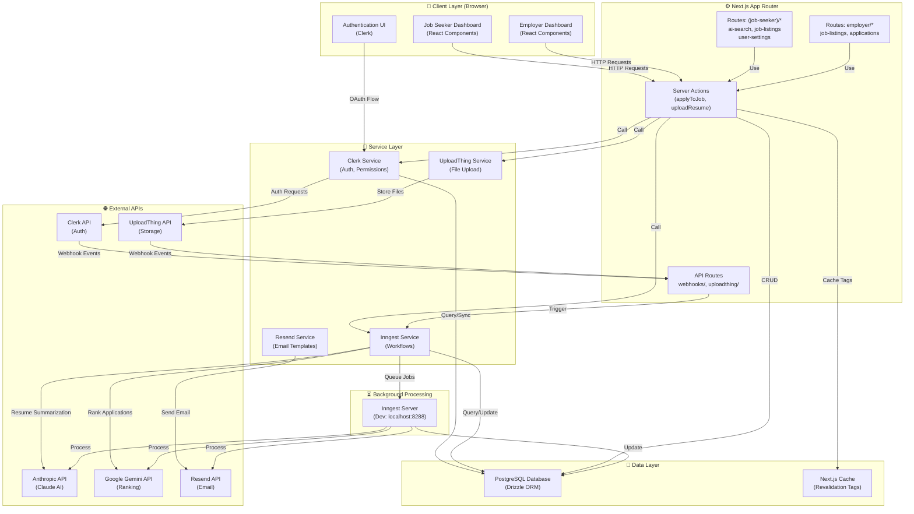

# Component Diagram



## Component Descriptions

### 📱 Client Layer

| Component | Purpose | Technology |
|-----------|---------|-----------|
| **Job Seeker Dashboard** | Browse jobs, apply, view applications, manage resume | React + Next.js Client Components |
| **Employer Dashboard** | Post jobs, view applications, rank candidates | React + Next.js Client Components |
| **Authentication UI** | Sign-in, organization selection | Clerk React Components |

### ⚙️ Next.js App Router

| Component | Purpose | Pattern |
|-----------|---------|---------|
| **Server Actions** | CRUD operations with Zod validation, Clerk permissions | `"use server"` |
| **Job Seeker Routes** | `/ai-search`, `/job-listings`, `/user-settings/*` | Parallel routes with `@sidebar` |
| **Employer Routes** | `/employer/job-listings`, `/employer/job-listings/[id]` | Standard dynamic routes |
| **API Routes** | Webhook handlers for Clerk, UploadThing; Inngest serving | Route Handlers |

### 🔧 Service Layer

| Service | Responsibility | Key Functions |
|---------|-----------------|----------------|
| **Clerk Service** | Authentication, authorization, org/user sync | `hasOrgUserPermission()`, `getCurrentUser()` |
| **Inngest Service** | Async workflows, AI processing, email digests | Resume summarization, application ranking, email triggers |
| **Resend Service** | Email template rendering and sending | Job digest, application updates, notifications |
| **UploadThing Service** | File upload/storage configuration | Resume file handling, URL generation |

### 💾 Data Layer

| Component | Purpose |
|-----------|---------|
| **PostgreSQL** | Persistent storage: Users, Jobs, Applications, Resumes |
| **Next.js Cache** | Response caching with `"use cache"` + `revalidateTag()` |

### 🌐 External APIs

| API | Purpose | Integration Type |
|-----|---------|------------------|
| **Clerk** | User/org authentication and management | OAuth + Webhooks |
| **Anthropic Claude** | Resume text extraction, summarization, search embeddings | REST API (via Inngest) |
| **Google Gemini** | Application ranking and scoring | REST API (via Inngest) |
| **Resend** | Email delivery | REST API |
| **UploadThing** | File storage and CDN | SDK + Webhooks |

### ⏳ Background Processing

| Component | Purpose | Trigger |
|-----------|---------|---------|
| **Inngest Server** | Job queue processor (dev: port 8288) | Server Actions, Webhooks, Scheduled |

## Data Flow Summary

```
User Action (UI)
    ↓
Server Action (Validation + Auth)
    ↓
Database Transaction
    ↓
Cache Invalidation (revalidateTag)
    ↓
Inngest Job (async)
    ↓
External API (Claude/Gemini/Resend)
    ↓
Database Update
    ↓
User Notification (Email/UI)
```

## Deployment Architecture

### Development
```
Local Machine
├── Next.js Dev Server (port 3000)
├── Inngest Dev Server (port 8288)
├── PostgreSQL (local or docker)
└── React Email Preview (port 3001)
```

### Production (Self-hosted with PM2/Docker)
```
Server
├── Next.js App (port 3000)
├── Inngest Queue (separate service)
├── PostgreSQL (managed)
├── Redis (optional, for caching)
└── Nginx (reverse proxy)
```
