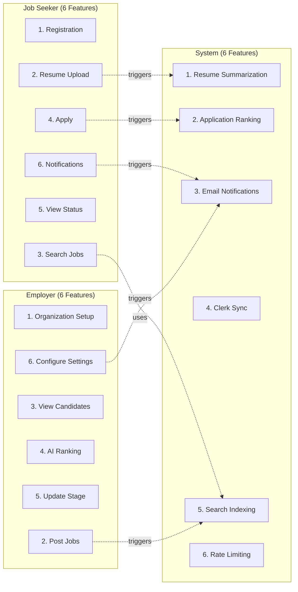
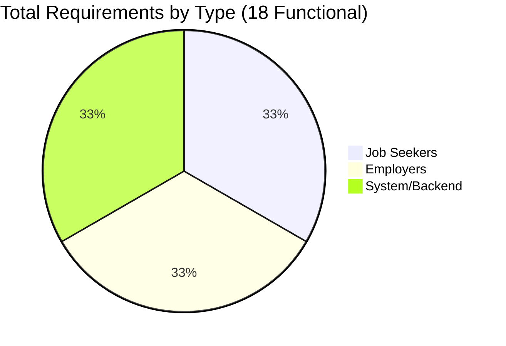
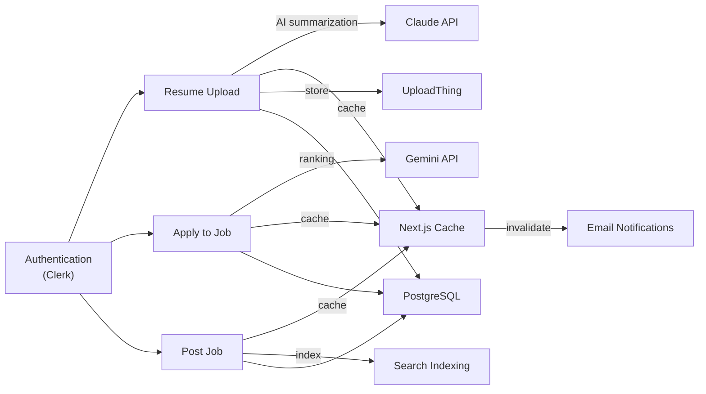

# Features & Requirements Tree Diagram

## CareerBridge Feature Hierarchy

```mermaid
graph TD
    CB["🎯 CareerBridge<br/>Marketplace"]
    
    CB --> JS["👥 Job Seeker Features"]
    CB --> EMP["🏢 Employer Features"]
    CB --> SYS["⚙️ System Features"]
    
    %% Job Seeker Features
    JS --> JS1["🔐 Registration & Profile"]
    JS --> JS2["📄 Resume Management"]
    JS --> JS3["🔍 Job Search"]
    JS --> JS4["📨 Applications"]
    JS --> JS5["⚙️ Preferences"]
    
    JS1 --> JS1A["Sign up via OAuth"]
    JS1 --> JS1B["Profile creation"]
    JS1 --> JS1C["Clerk sync"]
    
    JS2 --> JS2A["Upload PDF"]
    JS2 --> JS2B["AI summarization"]
    JS2 --> JS2C["View summary"]
    
    JS3 --> JS3A["AI semantic search"]
    JS3 --> JS3B["Filter by location/level"]
    JS3 --> JS3C["Browse listings"]
    
    JS4 --> JS4A["Submit application"]
    JS4 --> JS4B["Add cover letter"]
    JS4 --> JS4C["View status"]
    JS4 --> JS4D["Track pipeline"]
    
    JS5 --> JS5A["Toggle job emails"]
    JS5 --> JS5B["Set AI prompt"]
    JS5 --> JS5C["Manage notifications"]
    
    %% Employer Features
    EMP --> EMP1["🏭 Organization Setup"]
    EMP --> EMP2["📋 Job Listings"]
    EMP --> EMP3["👤 Candidate Review"]
    EMP --> EMP4["📊 Pipeline Management"]
    EMP --> EMP5["⚙️ Organization Settings"]
    
    EMP1 --> EMP1A["Create org"]
    EMP1 --> EMP1B["Add team members"]
    EMP1 --> EMP1C["Manage roles"]
    
    EMP2 --> EMP2A["Create job"]
    EMP2 --> EMP2B["Publish/delist"]
    EMP2 --> EMP2C["Feature job"]
    EMP2 --> EMP2D["View stats"]
    
    EMP3 --> EMP3A["View applications"]
    EMP3 --> EMP3B["AI ranking"]
    EMP3 --> EMP3C["View resume summary"]
    EMP3 --> EMP3D["Read cover letter"]
    
    EMP4 --> EMP4A["Change stage"]
    EMP4 --> EMP4B["Update status"]
    EMP4 --> EMP4C["Filter by score"]
    
    EMP5 --> EMP5A["Email preferences"]
    EMP5 --> EMP5B["Minimum rating"]
    EMP5 --> EMP5C["Team settings"]
    
    %% System Features
    SYS --> SYS1["🤖 AI Processing"]
    SYS --> SYS2["📧 Communications"]
    SYS --> SYS3["🔄 Integrations"]
    SYS --> SYS4["📁 Storage"]
    
    SYS1 --> SYS1A["Resume summarization"]
    SYS1 --> SYS1B["Application ranking"]
    SYS1 --> SYS1C["Job search embeddings"]
    
    SYS2 --> SYS2A["Transactional emails"]
    SYS2 --> SYS2B["Daily job digest"]
    SYS2 --> SYS2C["Status updates"]
    
    SYS3 --> SYS3A["Clerk webhooks"]
    SYS3 --> SYS3B["Search indexing"]
    SYS3 --> SYS3C["Cache invalidation"]
    
    SYS4 --> SYS4A["Resume files"]
    SYS4 --> SYS4B["Database"]
    SYS4 --> SYS4C["File cleanup"]
```

---

## Feature Coverage Matrix

---

## Requirements by Category

---

## Non-Functional Requirements Summary

```mermaid
graph TB
    NFR["Non-Functional Requirements"]
    
    NFR --> PERF["Performance ⚡"]
    NFR --> SEC["Security 🔒"]
    NFR --> SCAL["Scalability 📈"]
    NFR --> AVAIL["Availability 🟢"]
    NFR --> USE["Usability 👤"]
    
    PERF --> PERF1["Page load: <2s"]
    PERF --> PERF2["API response: <500ms"]
    PERF --> PERF3["AI processing: <60s"]
    PERF --> PERF4["Email delivery: <5min"]
    
    SEC --> SEC1["OAuth (Clerk)"]
    SEC --> SEC2["RBAC (Org roles)"]
    SEC --> SEC3["TLS 1.3"]
    SEC --> SEC4["SQL injection prevention"]
    
    SCAL --> SCAL1["10,000+ concurrent users"]
    SCAL --> SCAL2["1M+ job listings"]
    SCAL --> SCAL3["100K+ applications/day"]
    
    AVAIL --> AVAIL1["99.5% SLA"]
    AVAIL --> AVAIL2["Daily backups"]
    AVAIL --> AVAIL3["RTO: 4 hours"]
    
    USE --> USE1["WCAG 2.1 AA"]
    USE --> USE2["Mobile responsive"]
    USE --> USE3["Clear error messages"]
```

---

## Feature Adoption Timeline

| Phase | Features | Timeline | Priority |
|-------|----------|----------|----------|
| **MVP** | Auth, Post Job, Apply, Search | Week 1-4 | 🔴 Critical |
| **Phase 1** | Resume Upload, AI Ranking, Email | Week 5-8 | 🔴 High |
| **Phase 2** | Daily Digest, Advanced Search, Analytics | Week 9-12 | 🟡 Medium |
| **Phase 3** | Video Interviews, Salary Negotiation | Q2 2026 | 🟢 Future |

---

## Feature Dependencies

---

## Functional Requirements Checklist

### ✅ Job Seeker Requirements (6)
- [ ] **FR-JS-001:** User Registration & Profile
- [ ] **FR-JS-002:** Upload Resume
- [ ] **FR-JS-003:** Search Jobs with AI
- [ ] **FR-JS-004:** Apply to Job
- [ ] **FR-JS-005:** View Application Status
- [ ] **FR-JS-006:** Manage Notification Settings

### ✅ Employer Requirements (6)
- [ ] **FR-EMP-001:** Organization Setup
- [ ] **FR-EMP-002:** Post Job Listing
- [ ] **FR-EMP-003:** View Ranked Candidates
- [ ] **FR-EMP-004:** Manage Application Stage
- [ ] **FR-EMP-005:** Configure Organization Settings
- [ ] **FR-EMP-006:** View Job Statistics

### ✅ System Requirements (6)
- [ ] **FR-SYS-001:** Resume AI Summarization
- [ ] **FR-SYS-002:** Application Auto-Ranking
- [ ] **FR-SYS-003:** Email Notifications
- [ ] **FR-SYS-004:** Clerk User Sync
- [ ] **FR-SYS-005:** Search Indexing
- [ ] **FR-SYS-006:** Rate Limiting & Quotas

---

## Key Metrics

| Metric | Target | Current |
|--------|--------|---------|
| **Functional Requirements** | 18 | ✅ 18 |
| **Non-Functional Requirements** | 25+ | ✅ 25+ |
| **Database Tables** | 7 | ✅ 7 |
| **API Endpoints** | 15+ | ✅ 15+ |
| **External Integrations** | 6 | ✅ 6 (Clerk, Claude, Gemini, Resend, UploadThing, PostgreSQL) |
| **Test Cases** | 200+ | ✅ 132+ (E2E), 250+ (Unit) |
