# Testing Requirements Diagrams

## Testing Pyramid

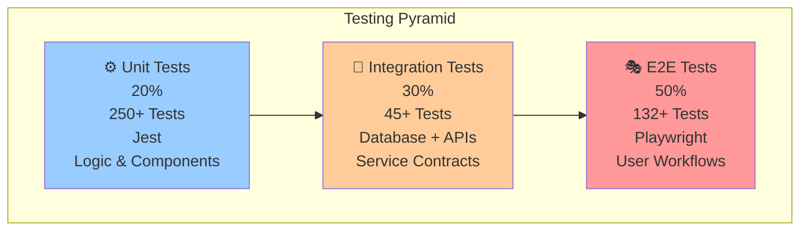

---

## Test Coverage Target

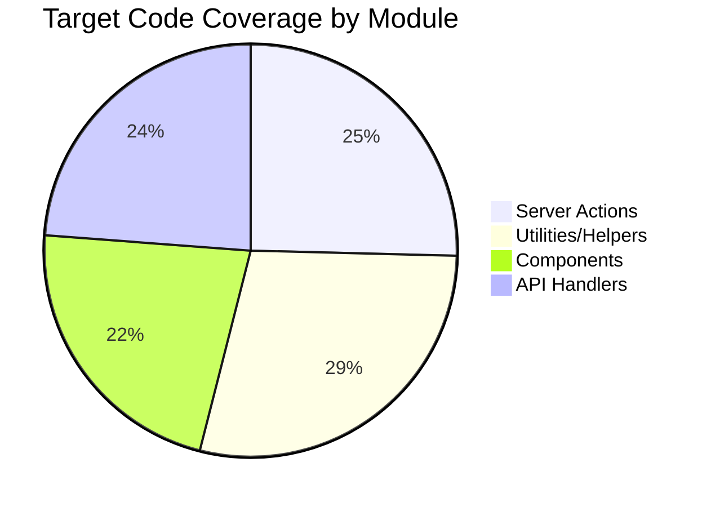

---

## Testing Strategy by Phase

```mermaid
graph LR
    subgraph Dev["Development<br/>(Continuous)"]
        DEV1["Unit Tests<br/>(Jest)"]
        DEV2["Type Checking<br/>(TypeScript)"]
        DEV3["Linting<br/>(ESLint)"]
    end
    
    subgraph Integration["Integration<br/>(Daily Nightly)"]
        INT1["API Contract Tests"]
        INT2["Database Tests"]
        INT3["Service Integration"]
    end
    
    subgraph E2E["E2E<br/>(PR/Merge)"]
        E2E1["User Workflows"]
        E2E2["Critical Paths"]
        E2E3["Regression Tests"]
    end
    
    subgraph Prod["Production<br/>(Post-Deploy)"]
        PROD1["Smoke Tests"]
        PROD2["Health Checks"]
        PROD3["Performance Monitoring"]
    end
    
    Dev --> Integration
    Integration --> E2E
    E2E --> Prod
```

---

## Test Execution Timeline

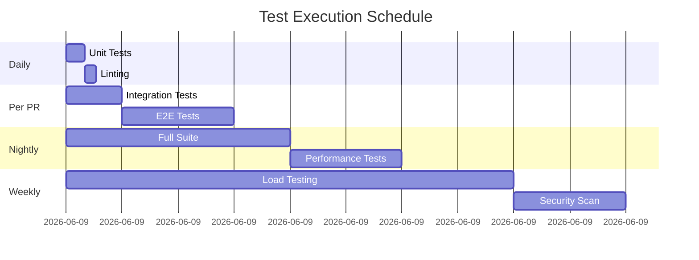

---

## Critical User Journeys to Test

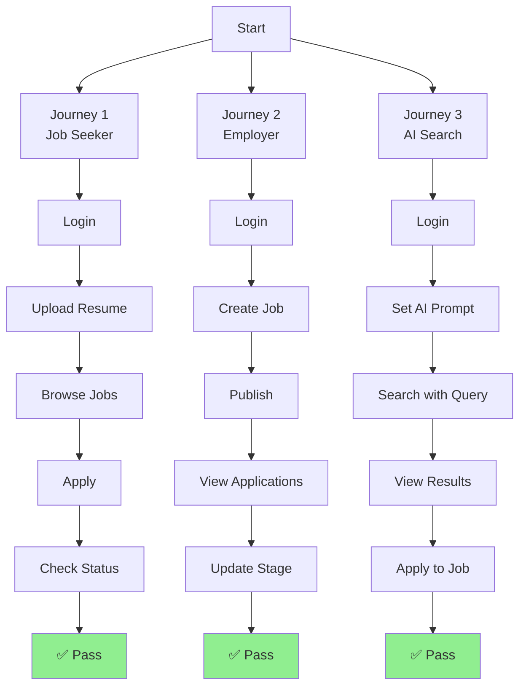

---

## Test Coverage by Feature

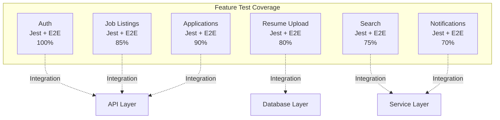

---

## Testing Tools & Technologies

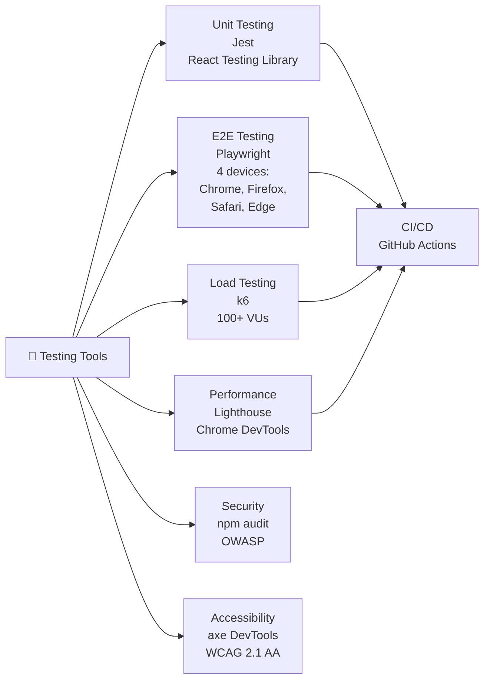

---

## Test Types & Focus

| Type | Tool | Focus | Target |
|------|------|-------|--------|
| **Unit** | Jest | Functions, components, logic | 70% coverage |
| **Integration** | Jest + API | Database, services, contracts | 45+ tests |
| **E2E** | Playwright | User workflows, critical paths | 132+ tests |
| **Performance** | k6, Lighthouse | Load, response time, FCP | <2s page load |
| **Security** | npm audit, OWASP | Injection, auth, CSRF | 0 vulnerabilities |
| **Accessibility** | axe, NVDA | WCAG 2.1 AA, keyboard nav | 0 violations |

---

## Test Data Management

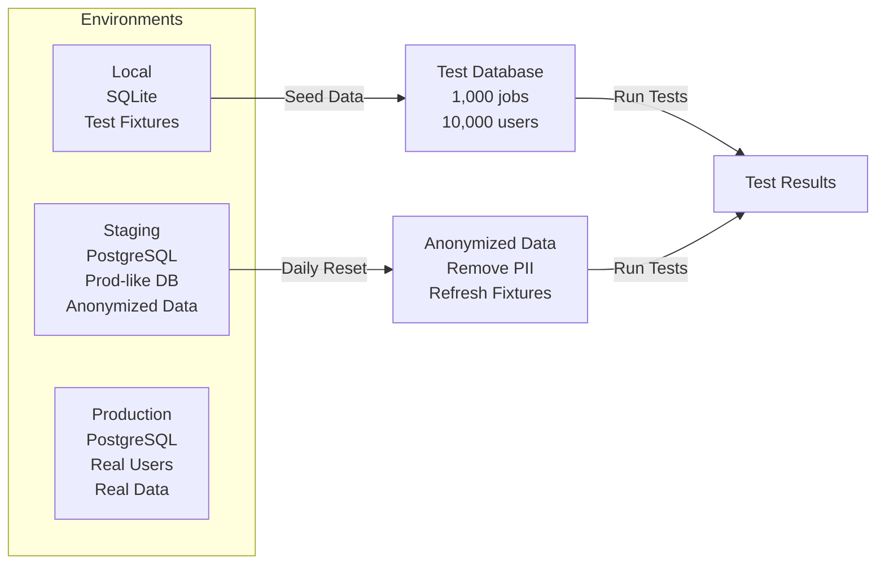

---

## Bug Severity & Response Time

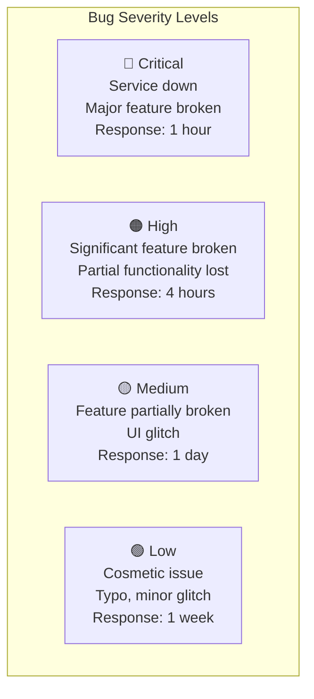

---

## Test Metrics & Reporting

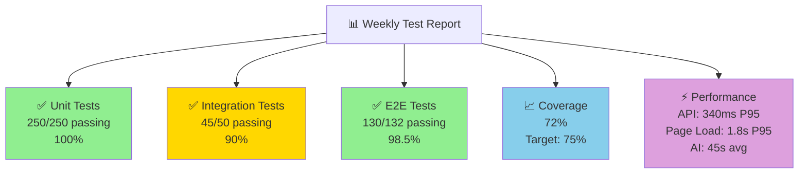

---

## Testing CI/CD Pipeline

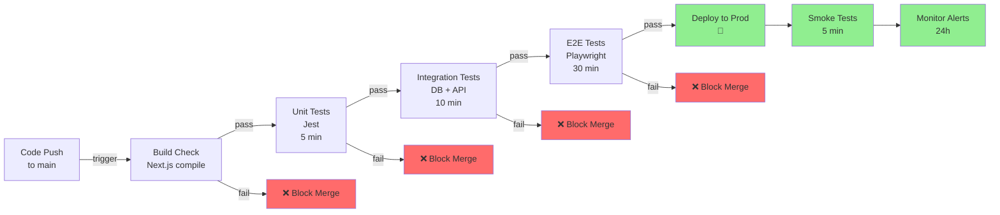

---

## Testing Checklist - Pre-Release

| Item | Status | Notes |
|------|--------|-------|
| ✅ Unit Tests | 100% | All tests passing |
| ✅ Integration Tests | 90%+ | Database & API layer |
| ✅ E2E Tests | 98%+ | User workflows |
| ✅ Code Coverage | >= 70% | Target coverage met |
| ✅ Critical Bugs | 0 | No blocking issues |
| ✅ Performance | < 2s | Page load time |
| ✅ Security Scan | 0 vulns | npm audit clean |
| ✅ Accessibility | 0 violations | WCAG 2.1 AA |
| ✅ Migrations | Tested | Database schema OK |
| ✅ API Contracts | Pass | Service agreements |
| ✅ Load Testing | 1000 VU OK | Stress test passed |
| ✅ Rollback Plan | Documented | Disaster recovery ready |

---

## Regression Test Suite

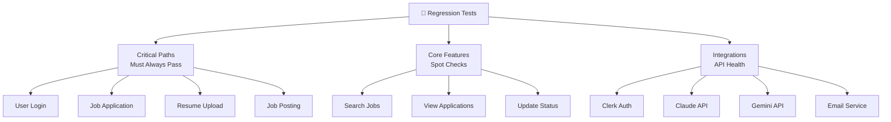

---

## Test Maintenance Guidelines

- **Monthly Review:** Remove obsolete tests, update fixtures
- **Flaky Tests:** Investigate if fails 2+ times in 10 runs
- **Coverage Gaps:** Add tests for new features before merging
- **Performance:** Monitor test execution time, optimize slow tests
- **Documentation:** Update test cases when behavior changes
